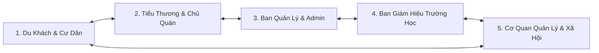
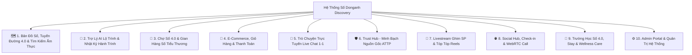

# 🌾 DONGANH DISCOVERY - BẢN ĐỒ SỐ ẨM THỰC, CHỢ SỐ 4.0 & TRƯỜNG HỌC SỐ ĐÔNG ANH

---

## 📖 1. TỔNG QUAN DỰ ÁN (PROJECT OVERVIEW)

### 🌟 1.1. Bối Cảnh & Tầm Nhìn Chiến Lược
Đông Anh là vùng đất giàu truyền thống di sản nghìn năm văn hiến. Trong tiến trình bứt phá phát triển thành đô thị thông minh hiện đại, việc chuyển đổi số nền kinh tế và đời sống xã hội địa phương là nhiệm vụ trọng tâm.

**Donganh Discovery (DongAnh Social / Food Map)** được nghiên cứu và phát triển như một **Hệ sinh thái Số hóa Đa năng toàn diện**, hợp nhất giữa:
* 🌾 **Nông thôn mới thông minh & Chuyển đổi số địa phương**
* 🏛️ **Du lịch di sản & Bảo tồn văn hóa làng nghề**
* 🛒 **Thương mại điện tử Chợ Số 4.0 & Phát triển kinh tế đêm**
* 🏫 **Trường Học Số 4.0 & Quản lý Giáo dục thông minh**
* 🌐 **Mạng xã hội trải nghiệm ẩm thực & Kết nối cộng đồng số**

Nền tảng không chỉ là một trang thông tin đơn thuần, mà là một **Hệ điều hành số thu nhỏ** kết nối mượt mà giữa không gian thực địa và không gian số, tạo đà bứt phá cho nông sản OCOP, tiểu thương chợ truyền thống, các trường học địa phương và trải nghiệm du lịch ẩm thực.

---

### 🎯 1.2. 5 Trụ Cột Đột Phá Của Hệ Thống
1. **Số hóa không gian Ẩm thực, Di sản & Tuyến đường 4.0:** Xây dựng bản đồ số 3D/GPS sống động, quy hoạch **Tuyến đường Ẩm thực 4.0** tích hợp trí tuệ nhân tạo (AI Food Tour Engine) tự động lập hành trình ăn uống - tham quan cá nhân hóa.
2. **Số hóa Chợ truyền thống (Chợ Số 4.0):** Biến mỗi chợ truyền thống thành một sàn thương mại điện tử trực tuyến, nâng tầm tiểu thương thành những "chủ gian hàng số" hiện đại.
3. **Minh bạch hóa An toàn thực phẩm (Trust Hub):** Xây dựng niềm tin số cho người tiêu dùng thông qua nhật ký thực phẩm hằng ngày, chứng nhận ATTP và minh bạch nguồn gốc nông sản VietGAP/OCOP.
4. **Bùng nổ Truyền thông tương tác:** Tích hợp Livestream trực tiếp có tính năng **Ghim sản phẩm Mua ngay real-time** kết hợp kho Video ngắn (Tóp Tóp Reels) bắt trend.
5. **Trường Học Số 4.0 & Mạng Xã Hội Cộng Đồng:** Xây dựng Cổng thông tin Trường Học Số cho Ban Giám Hiệu/Hiệu trưởng quản lý trường học, kết nối cư dân qua bài viết check-in, định vị bạn bè xung quanh (`Social Nearby`) và cuộc gọi Video Call WebRTC thời gian thực.

---

### 🤝 1.3. Phân Tích Chi Tiết Các Đối Tượng Trọng Tâm (Stakeholders)

#### 🧑‍💻 1. Du Khách & Người Dân Địa Phương (Consumers & Explorers)
* **Khám phá ẩm thực thông minh:** Định vị vị trí hiện tại qua GPS, trải nghiệm **Tuyến đường Ẩm thực 4.0 (`/tuyen-duong-40`)**, tìm kiếm nhanh các món ăn signature và xem đánh giá thực tế.
* **Lên lịch trình bằng AI:** Trợ lý AI tự động đề xuất lộ trình ăn uống theo ngân sách và thời gian rảnh, lưu nhật ký hành trình ẩm thực (`Food Diary`).
* **Trải nghiệm mua sắm tiện lợi:** Dạo chợ số 4.0, chọn sản phẩm OCOP, thêm vào giỏ hàng, thanh toán online, theo dõi đơn hàng và re-order 1-click.
* **Giao lưu xã hội số:** Đăng bài check-in, thả tim/bình luận, theo dõi bạn bè xung quanh (`Nearby GPS`), nhắn tin P2P và gọi Video Call WebRTC miễn phí.

#### 🏪 2. Tiểu Thương & Chủ Cơ Sở Kinh Doanh (Merchants & Vendors)
* **Sở hữu Gian hàng số 4.0 chuẩn SEO:** Trưng bày danh mục món ăn, sản phẩm OCOP, hồ sơ gian hàng và bảng giá công khai gắn với các tuyến đường ẩm thực.
* **Bán hàng đa kênh hiện đại:** Tiếp cận khách hàng qua kênh **Livestream ghim sản phẩm mua ngay** và kênh lướt Video Reels ngắn.
* **Tương tác trực tiếp 1-1:** Trò chuyện ngay tức thì với người mua qua hệ thống **Live Chat**, nhận thông báo tin nhắn chưa đọc real-time.
* **Quản lý đơn hàng & Đa thực thể:** Quản lý vòng đời đơn hàng (Mới $\rightarrow$ Đang giao $\rightarrow$ Hoàn thành), dễ dàng chuyển đổi quản lý nhiều gian hàng cùng lúc (`Switch Entity`).
* **Khẳng định uy tín với Trust Hub:** Công khai Giấy chứng nhận ATTP và cập nhật nhật ký nhập hàng tươi sống hằng ngày để thu hút khách hàng.

#### 🎓 3. Ban Giám Hiệu & Nhà Trường (Principals & School Management)
* **Cổng điều hành Trường Học Số (`/principal/dashboard`):** Phân quyền riêng cho Hiệu trưởng và Ban Giám Hiệu quản lý toàn diện thông tin nhà trường trên không gian số.
* **Đăng tải Truyền thông & Story 24h (`/stories`):** Đăng các bài viết tin tức, thành tích nhà trường, câu chuyện truyền cảm hứng và đăng tải Story khoảnh khắc 24h.
* **Quản lý Thư viện Đa phương tiện:** Lưu trữ và quản lý Thư viện ảnh thực tế, Thư viện Video các sự kiện, hoạt động ngoại khóa của học sinh.
* **Quản lý Chương trình đào tạo & Sáp nhập:** Cập nhật công khai chương trình học (`/education-programs`) và số hóa dữ liệu sáp nhập trường học trên địa bàn.

#### 🏛️ 4. Ban Quản Lý Chợ & Quản Trị Viên (Market Board & System Admins)
* **Quy hoạch chợ số tập trung:** Thiết lập và quản lý sơ đồ gian hàng trực tuyến cho từng chợ truyền thống (Chợ Cổ Loa, Chợ Đông Anh...).
* **Truyền thông bảng tin số:** Đăng tải thông báo, nội quy chợ và tin tức chính thức từ BQL tới tiểu thương và người mua.
* **Kiểm duyệt & An toàn:** Phê duyệt gian hàng mới, kiểm soát chất lượng sản phẩm OCOP, duyệt video reels và theo dõi báo cáo đơn hàng toàn chợ.
* **Vận hành hệ thống thông minh:** Quản lý phân quyền tài khoản đa vai trò, dọn dẹp bình luận rác/bot spam tự động trong 1-click (`Clean Spam Bot Engine`) và tự động cập nhật Sitemap XML chuẩn SEO Google.

#### 🏢 5. Cơ Quan Quản Lý Địa Phương & Cộng Đồng (Local Government & Ecosystem)
* **Thúc đẩy Kinh tế số & Kinh tế đêm:** Tạo đột phá chuyển đổi số cho ngành bán lẻ, dịch vụ ăn uống, thương mại nông sản địa phương và **Tuyến đường Ẩm thực 4.0**.
* **Bảo tồn & Quảng bá Văn hóa - Di sản:** Số hóa thông tin các điểm di tích lịch sử Quốc gia đặc biệt (Thành Cổ Loa...), làng nghề múa rối nước Đào Thục, chạm khắc gỗ Vân Hà... kết hợp góc trải nghiệm văn hóa (`/exp-corner`).
* **Hệ sinh thái Tiện ích Xã hội toàn diện:**
  * **Lưu trú (Stay in Đông Anh):** Số hóa hệ thống khách sạn, homestay phục vụ du khách lưu trú.
  * **Y tế & Chăm sóc sức khỏe (Wellness & Care):** Kết nối các trung tâm y tế, spa, dịch vụ chăm sóc sức khỏe uy tín.

---

## 🧭 2. CẤU TRÚC MENU ĐIỀU HƯỚNG CHÍNH (MAIN NAVIGATION MENU)

Hệ thống cung cấp thanh điều hướng trực quan, dễ dàng thao tác trên cả máy tính và điện thoại thông minh:

| Biểu tượng & Mục Menu | Chức năng & Nội dung hiển thị chính | Đường dẫn Route |
| :--- | :--- | :--- |
| 🏠 **Trang chủ** | **Trung tâm trải nghiệm:** Cổng đón khách chính với Banner Slider sự kiện rực rỡ, lối tắt truy cập nhanh các địa điểm ẩm thực Hot, sản phẩm OCOP nổi bật và các Chợ Số 4.0. | `/` |
| 📰 **Bản tin** | **Kênh truyền thông địa phương:** Cập nhật tin tức ẩm thực, sự kiện văn hóa di sản, thông báo chính thức từ Ban Quản Lý Chợ và bài viết tin tức từ hệ thống Trường Học Số. | `/ban-tin` |
| 🗺️ **Bản đồ & Tìm kiếm** | **Trợ lý định vị & Tra cứu thông minh:** Tìm kiếm từ khóa theo món ăn, địa chỉ, loại hình dịch vụ; hiển thị vị trí trên Bản đồ vệ tinh GPS; gợi ý quán ngon xung quanh và Tuyến Đường Ẩm Thực 4.0. | `/tim-kiem` |
| 🍜 **Food Tour** | **Hành trình ẩm thực & AI Generator:** Khám phá danh sách các tour ăn uống do cộng đồng chia sẻ, công cụ **Tạo Food Tour tự động bằng AI** theo ngân sách và lưu **Nhật ký hành trình (`Food Diary`)**. | `/food-tours` |
| 🏺 **Góc trải nghiệm thực tế** | **Du lịch di sản & Làng nghề tương tác:** Số hóa và kết nối du khách với các hoạt động trải nghiệm thực tế: Múa rối nước Đào Thục, chạm khắc mộc Vân Hà, gói bánh chưng Tranh Khúc và tour nấu ăn dân dã. | `/exp-corner` |
| 📷 **Góc Check-in** | **Mạng xã hội khoảnh khắc:** Nơi người dùng chia sẻ hình ảnh check-in thực tế tại các quán ăn/di tích ở Đông Anh, tương tác thả tim, bình luận và chia sẻ bài viết real-time. | `/checkin` |
| 📖 **Giới thiệu & Hướng dẫn** | **Trung tâm hỗ trợ & Quy chuẩn:** Cung cấp thông tin sứ mệnh dự án Donganh Discovery, tài liệu hướng dẫn sử dụng cho Du khách, hướng dẫn làm chủ Gian hàng số cho Tiểu thương & Quy chuẩn An toàn thực phẩm `Trust Hub`. | `/gioi-thieu` |

---

## 📊 3. SƠ ĐỒ BAO QUÁT CÁC DANH MỤC CHỨC NĂNG (SYSTEM ARCHITECTURE OVERVIEW)

---

## 🔎 4. CHI TIẾT TỪNG DANH MỤC & CHỨC NĂNG (DEEP-DIVE FEATURE CATALOG)

### 🗺️ DANH MỤC 1: BẢN ĐỒ SỐ ẨM THỰC, TUYẾN ĐƯỜNG 4.0 & TÌM KIẾM THÔNG MINH (DIGITAL FOOD MAP & ROUTE 4.0)
Hệ thống số hóa toàn bộ vị trí địa điểm ăn uống, nhà hàng, quán ăn vỉa hè và điểm di sản tại Đông Anh trên bản đồ tương tác và quy hoạch thành các tuyến đường khám phá 4.0.
- **Bản đồ tương tác GPS (Interactive Map):** Hiển thị trực quan vị trí địa lý của các cơ sở ẩm thực với các ghim phân loại rõ ràng (Quán ăn, OCOP, Di tích, Chợ).
- **Tuyến Đường Ẩm Thực 4.0 (`/tuyen-duong-40`):** Quy hoạch và số hóa các cung đường khám phá văn hóa & ẩm thực trọng điểm (Phố đêm Cổ Loa, Tuyến phố ẩm thực trung tâm, Tuyến di sản làng nghề...). Chỉ đường thông minh kết nối liên hoàn các ghim địa điểm ẩm thực.
- **Tìm kiếm thông minh (Smart Search & Quick Search API):** Gợi ý kết quả ngay lập tức khi gõ từ khóa món ăn, tên quán, địa chỉ hoặc loại hình dịch vụ.
- **Định vị xung quanh (Nearby Eateries Engine):** Tự động phát hiện vị trí hiện tại của người dùng qua GPS để đề xuất các quán ăn ngon nhất trong bán kính gần nhất.
- **Trang Chi Tiết Địa Điểm Chuẩn SEO (`/dia-diem/{slug}`):** Hiển thị đầy đủ thông tin quán, giờ mở cửa, menu, không gian, chỉ đường Google Maps và món ăn đặc trưng (*Signature Dish*).
- **Tương tác & Đánh giá (Review & Reaction System):** Khách hàng chấm điểm sao (1-5★), viết bình luận có hình ảnh, thả tim bài viết và xem danh sách người đã thích (`Likers`).

---

### 🤖 DANH MỤC 2: TRỢ LÝ AI LÊN LỘ TRÌNH & NHẬT KÝ HÀNH TRÌNH (AI FOOD TOUR ENGINE)
Tích hợp trí tuệ nhân tạo để cá nhân hóa trải nghiệm du lịch ẩm thực cho người dùng.
- **Động cơ AI Tạo Lộ Trình Tự Động (`/api/food-tours/generate-ai`):** Người dùng nhập thời gian rảnh (buổi sáng/cả ngày), ngân sách dự kiến (ví dụ: 100k, 200k) và sở thích $\rightarrow$ AI tự động phân tích và tạo lịch trình di chuyển tối ưu từng điểm đến.
- **Tạo & Quản lý Food Tour Cá Nhân (`/food-tours`):** Người dùng có thể tự thiết kế, chỉnh sửa, cập nhật hoặc xóa lịch trình khám phá ẩm thực của riêng mình.
- **Chia sẻ Hành trình (Food Tour Sharing):** Tạo liên kết chia sẻ lộ trình ăn uống cho nhóm bạn bè hoặc cộng đồng.
- **Nhật ký Hành trình Ẩm thực (`Food Diary`):** Cho phép ghi lại cảm nhận, hình ảnh kỷ niệm tại từng chặng dừng chân trong chuyến đi.
- **Góc Trải Nghiệm Văn Hóa (`/exp-corner`):** Kết nối các tour trải nghiệm làm bánh chưng, múa rối nước, nấu ăn truyền thống.

---

### 🏪 DANH MỤC 3: CHỢ SỐ 4.0 & GIAN HÀNG SỐ TIỂU THƯƠNG (DIGITAL MARKETS 4.0)
Giải pháp số hóa toàn bộ hệ thống chợ truyền thống (Chợ Cổ Loa, Chợ Trung Tâm...) sang mô hình Chợ 4.0.
- **Trang Chợ Số Tập Trung (`/cho/{marketSlug}`):** Không gian hiển thị danh sách các gian hàng theo ngành hàng (Thực phẩm tươi sống, Nông sản OCOP, Đồ khô, Ẩm thực).
- **Trang Gian Hàng Số Tiểu Thương (`/cho/{marketSlug}/gian-hang/{stallSlug}`):** Mỗi tiểu thương có một trang gian hàng chuẩn SEO riêng biệt, hiển thị thông tin chủ gian, mã gian hàng, menu sản phẩm, đánh giá và bảng tin thông báo từ Ban Quản Lý Chợ.
- **Kênh Điều Hành Tiểu Thương (Seller Vendor Dashboard):** Trục quản lý riêng cho tiểu thương để:
  * Đăng tải và cập nhật sản phẩm gian hàng (`/seller/products`).
  * Quản lý hồ sơ pháp lý / giấy phép kinh doanh (`Dossier`).
  * Theo dõi danh sách đơn hàng và chuyển đổi trạng thái đơn (Mới, Đang xử lý, Hoàn thành, Hủy).
- **Chuyển Đổi Đa Thực Thể (Switch Entity Engine):** Cho phép một tài khoản tiểu thương quản lý cùng lúc nhiều gian hàng hoặc nhiều cơ sở kinh doanh khác nhau trên hệ thống.

---

### 🛒 DANH MỤC 4: THƯƠNG MẠI ĐIỆN TỬ, GIỎ HÀNG & THANH TOÁN (E-COMMERCE ENGINE)
Hệ thống thương mại điện tử hoàn chỉnh hỗ trợ mua sắm từ đặc sản OCOP đến nông sản chợ phiên.
- **Sản Phẩm OCOP Đông Anh (`/san-pham-ocop/{slug}`):** Quảng bá danh mục sản phẩm đạt chứng nhận OCOP 3 sao, 4 sao, 5 sao của huyện với thông tin chứng nhận rõ ràng.
- **Sản Phẩm Cơ Sở Kinh Doanh (`/san-pham/{slugOrId}`):** Trưng bày chi tiết hàng hóa, món ăn của từng cửa hàng.
- **Quản Lý Giỏ Hàng Trực Tuyến (Cart Engine):** Thêm sản phẩm, điều chỉnh số lượng, tính toán tổng tiền tự động và dọn dẹp giỏ hàng (`/cart`).
- **Thanh Toán & Đặt Hàng (Checkout System):** 
  * Nhập thông tin giao hàng, áp dụng mã ưu đãi và chọn phương thức thanh toán.
  * Sinh mã đơn hàng tự động duy nhất (`Order Code`).
- **Quản Lý Đơn Hàng Người Dùng (`/orders`):**
  * Theo dõi tiến trình xử lý đơn hàng.
  * Hủy đơn hàng khi chưa giao.
  * Xác nhận "Đã nhận hàng".
  * Yêu cầu Đổi/Trả hàng và hoàn tiền.
  * Tính năng **Đặt Lại Đơn (Reorder 1-Click)** giúp khách mua lại đơn hàng cũ cực nhanh.
  * Đánh giá chất lượng đơn hàng sau khi hoàn tất.

---

### 💬 DANH MỤC 5: TRÒ CHUYỆN TRỰC TUYẾN LIVE CHAT 1-1 (MARKET CHAT SYSTEM)
Kênh kết nối tức thì giữa Khách hàng và Chủ gian hàng/Tiểu thương.
- **Live Chat Trực Tiếp 1-1 (`/seller/chat`):** Khách hàng bấm nhắn tin trên gian hàng $\rightarrow$ Cửa sổ chat kết nối thẳng tới Dashboard của tiểu thương.
- **Lịch Sử Trò Chuyện & Cuộc Hội Thoại (Conversations API):** Quản lý danh sách khách hàng đang nhắn tin ngăn nắp.
- **Thông Báo Tin Nhắn Chưa Đọc (`Unread Count API`):** Đếm số tin nhắn mới real-time giúp tiểu thương không phản hồi sót khách.

---

### 🛡️ DANH MỤC 6: TRUNG TÂM MINH BẠCH & AN TOÀN THỰC PHẨM (TRUST HUB & TRACEABILITY)
Đảm bảo tiêu chuẩn vệ sinh an toàn thực phẩm và nguồn gốc xuất xứ nông sản.
- **Quản Lý Giấy Chứng Nhận ATTP (Food Safety Certificates):** Lưu trữ và hiển thị công khai chứng nhận an toàn thực phẩm của quán ăn/gian hàng.
- **Nhật Ký Thực Phẩm Hằng Ngày (Daily Food Log):** Cho phép cơ sở cập nhật danh mục nguyên liệu tươi sống nhập trong ngày (VD: Thịt lợn sinh học nhập lúc 4h sáng, Rau sạch VietGAP...).
- **Hợp Đồng Nguồn Cung Sạch (Food Supply Contracts):** Minh bạch hợp đồng ký kết với các trang trại, hợp tác xã cung cấp nguyên liệu.
- **Hóa Đơn Nhập Hàng (Purchase Invoices):** Lưu giữ hóa đơn chứng từ chứng minh nguồn gốc nông sản sạch.

---

### 🎥 DANH MỤC 7: TRUYỀN THÔNG TƯƠNG TÁC: LIVESTREAM GHIM SP & TÓP TÓP REELS
Đột phá trải nghiệm mua sắm và giải trí qua Video ngắn & Phát trực tiếp.
- **Nền Tảng Livestream Trực Tiếp Đông Anh (`/livestream`):**
  * **Host Livestream:** Tiểu thương/Nhà sáng tạo nội dung phát sóng trực tiếp từ trình duyệt (`/livestream/host/{id}`).
  * **Tương tác Real-time:** Người xem thả tim, gửi bình luận trực tiếp trên luồng live, cập nhật số lượng người xem thời gian thực (`Viewer Count`).
  * **Ghim Sản Phẩm Trực Tiếp (Pin Product Real-time):** Chủ phòng live có thể ghim sản phẩm/món ăn lên màn hình phát sóng để người xem bấm Mua Ngay tức thì.
- **Kênh Tóp Tóp Video Reels (`/api/videos`):** Trang lướt video ngắn chuẩn xu hướng TikTok/Reels về ẩm thực, ngắm nhìn món ăn chân thực và thả tim tương tác.
- **Tích Hợp YouTube OAuth 2.0 (`/youtube/auth`):** Kết nối 1-click tài khoản YouTube để đồng bộ video quảng bá.

---

### 🌐 DANH MỤC 8: MẠNG XÃ HỘI, CHECK-IN & CUỘC GỌI VIDEO CALL WEBRTC (SOCIAL HUB)
Trục mạng xã hội thu hút giới trẻ và cư dân địa phương kết nối.
- **Bảng Tin & Bài Đăng Check-in (`/ban-tin`, `/checkin`):** Khách hàng chia sẻ bài viết, hình ảnh check-in thực tế tại các địa điểm ăn uống ở Đông Anh.
- **Social Hub Portal (Inertia.js + React.js `/social`):** Giao diện mạng xã hội mượt mà không load lại trang.
- **Định Vị Bạn Bè Xung Quanh (Social Nearby GPS):** Cập nhật tọa độ GPS cá nhân và tìm kiếm bạn bè đang ở gần vị trí của mình.
- **Quản Lý Kết Bạn:** Gửi lời mời kết bạn, Chấp nhận / Từ chối lời mời.
- **Nhắn Tin P2P & Cuộc Hội Thoại Gần Đây (Recent Chats):** Trò chuyện riêng tư giữa người dùng với người dùng.
- **Cuộc Gọi Audio / Video Call P2P Chuẩn WebRTC:**
  * Khởi tạo cuộc gọi (`Initiate Call`), truyền phát tín hiệu (`Signal Call`), trả lời hoặc ngắt máy (`Hangup Call`).
  * Kiểm tra trạng thái cuộc gọi chờ (`Pending Call`), kiểm tra thời lượng & xem lại Lịch sử cuộc gọi (`Call History`).

---

### 🏫 DANH MỤC 9: TRƯỜNG HỌC SỐ 4.0 & HỆ SINH THÁI TIỆN ÍCH (DIGITAL SCHOOLS & UTILITIES)
Mở rộng hệ sinh thái số hóa các dịch vụ đời sống & giáo dục địa phương.
- **Cổng Quản Lý Trường Học Số Dành Cho Hiệu Trưởng (`Principal School Management`):**
  * **Kênh điều hành nhà trường (`/principal/schools/{id}/dashboard`):** Phân quyền riêng cho Ban Giám Hiệu / Hiệu Trưởng điều hành thông tin nhà trường.
  * **Đăng tải tin tức & Story 24h (`/stories`):** Đăng tải thông báo, bài viết thành tích nhà trường, câu chuyện truyền cảm hứng và khoảnh khắc Story 24h.
  * **Thư viện Đa phương tiện:** Lưu trữ & quản lý Thư viện ảnh thực tế và Thư viện Video sự kiện, hoạt động học sinh.
  * **Chương trình đào tạo & Sáp nhập (`/education-programs`, `/admin/schools`):** Cập nhật công khai chương trình giáo dục và số hóa dữ liệu sáp nhập trường học.
- **Phòng Nghỉ Lưu Trú (Stay in Đông Anh):** Danh sách và thông tin đặt phòng khách sạn, homestay, nhà nghỉ tại Đông Anh.
- **Dịch Vụ Y Tế & Spa (Wellness & Care):** Tìm kiếm và đặt lịch các trung tâm chăm sóc sức khỏe, spa, phòng khám chất lượng.

---

### ⚙️ DANH MỤC 10: QUẢN TRỊ HỆ THỐNG (ADMIN PORTAL)
Trung tâm điều hành dành cho Quản trị viên hệ thống (Admin) và Ban Quản Lý Chợ (Manager).
- **Quản Lý Địa Điểm Ẩm Thực (`/admin/eateries`):** Thêm mới, sửa, xóa cơ sở ẩm thực, trích xuất dữ liệu tự động từ liên kết Google Maps (`Parse Google Maps URL`).
- **Quản Lý Thực Đơn & Món Ăn:** Thêm/sửa/xóa món ăn, bật/tắt đánh dấu Món ăn đặc trưng (`Toggle Signature Dish`).
- **Quản Lý Gian Hàng & Đơn Hàng Toàn Chợ (`/admin/stalls`, `/admin/orders`):** Quản lý tiểu thương, phê duyệt gian hàng, kiểm soát đơn hàng toàn hệ thống.
- **Quản Lý Tài Khoản Người Dùng (`/admin/users`):** Phân quyền người dùng, Khóa/Mở tài khoản (`Toggle Status`), Xuất dữ liệu danh sách người dùng (`Export Users`).
- **Bộ Lọc Dọn Dẹp Spam Bot Thông Minh (`/clean-spam-comments`):** Tự động phát hiện và quét sạch tài khoản bot spam và bình luận rác trong 1-click.
- **Tự Động Sinh Sitemap XML (`/sitemap.xml`):** Tự động cập nhật sitemap giúp Google Index toàn bộ các trang địa điểm, gian hàng và sản phẩm tức thì.
- **Upload Media Đa Đợt (Batch Upload API):** Hỗ trợ đăng tải cùng lúc trên 33+ hình ảnh/video chất lượng cao mà không bị giới hạn bộ nhớ.

---

## 📄 4. GIẤY PHÉP & BẢO QUYỀN (LICENSE)

Dự án được xây dựng và phát triển độc quyền cho **Hệ sinh thái Số Ẩm thực & Chợ Số 4.0 Đông Anh (Donganh Discovery)**.  
Bản quyền © 2026 Donganh Discovery Team. All rights reserved.
